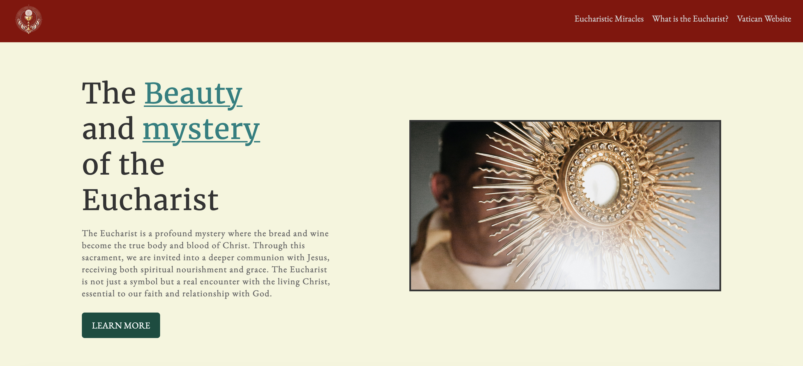

# Christ The King - Eucharist Web Page

## About The Project

This project is part of **The Odin Project**, where I created a web page from scratch based on a provided design. The task was to recreate the page as closely as possible using HTML and CSS, with a primary focus on layout and structure rather than exact pixel-perfect details.

### Features
- Header with navigation links to relevant external resources.
- Hero section with a headline, introductory text, and image.
- Grid layout showcasing the key aspects of the Eucharist.
- A quote section with a meaningful message from Pope Benedict XVI.
- A final section encouraging visitors to deepen their belief in the Eucharist.

The project aims to closely match a provided design image and colors but does **not** implement responsive design. This limitation was intentional as per the requirements of **The Odin Project**.

### Project Guidelines
- **HTML and CSS** only—no JavaScript involved.
- The page layout is not made compatible with smaller screen sizes as responsive design is not part of this project.
- The focus is on layout, structure, and getting elements positioned correctly.
- No pixel-perfect replication is necessary, and some creative liberty is allowed.

## Screenshot

## Technologies Used

- **HTML**: The basic structure of the page.
- **CSS**: Styling and layout using Flexbox, Grid, and other CSS properties.
- **Fonts**: Google Fonts, including "EB Garamond" and "Merriweather".
- **Images**: Placeholder images used, with credits to the original creators (see Credits section).

